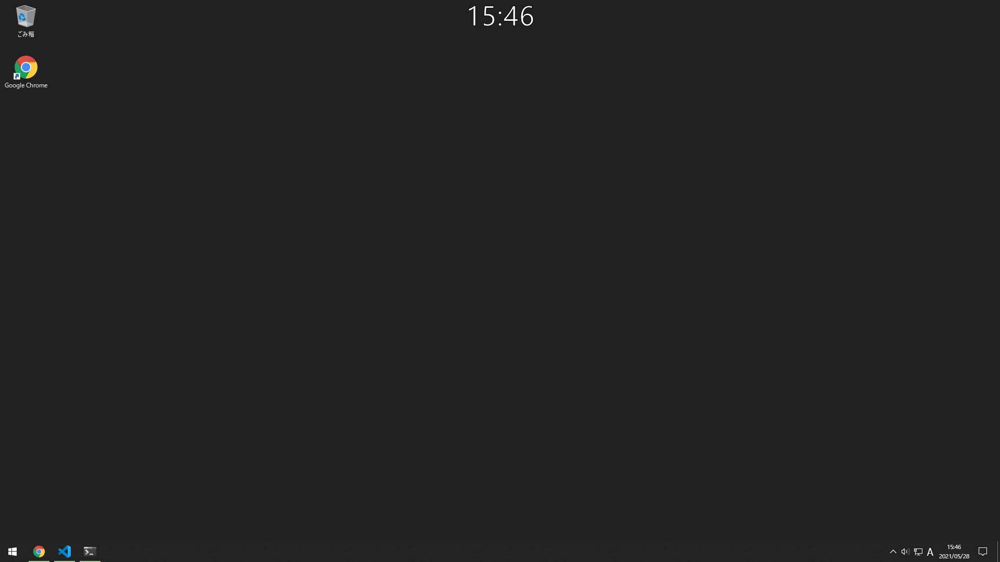

## moko256_clock_overlay
This is a simple clock overlay application for Windows only.

This application is inspired by TVClock's overlaying function.

### Features
- Clock
- Click-through
- White characters with black outline
- Keep center of top of display.
    - Tested in single display only.

### Usage
#### Start
- `cargo build --release`
- Move `target\release\clock_overlay.exe` anywhere
- Launch it

#### Stop
- Stop `clock_overlay.exe` from background tasks section in task manager.